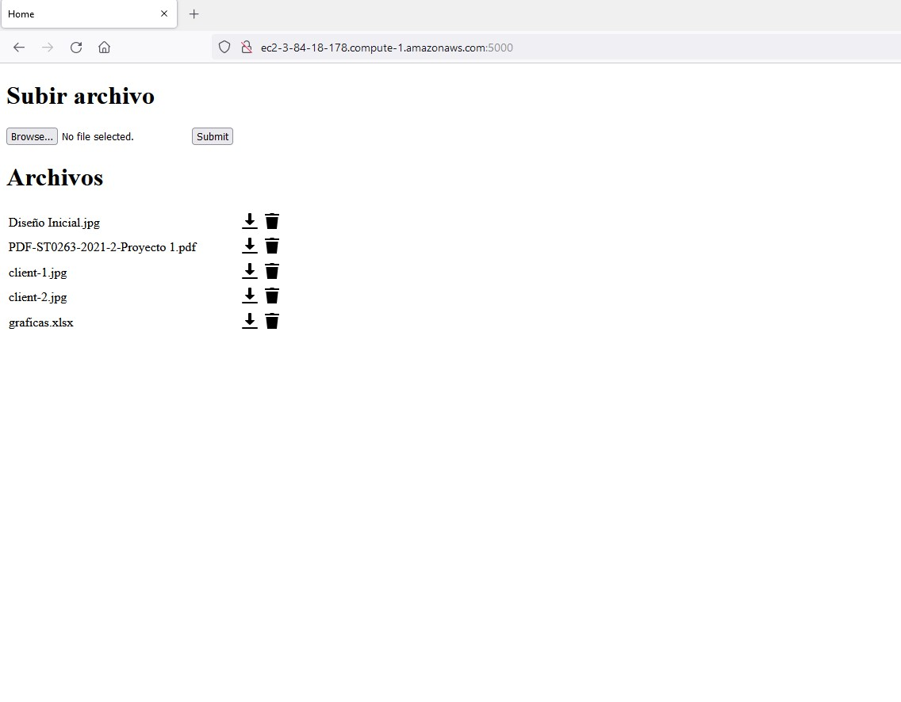

# Proyecto 1 - Sistemas Distribuidos

## Descripción
Este proyecto tiene una funcionalidad principal, que es permitirle a un usuario subir y descargar archivos a un sitio donde se almacenan. En lo que concierne al usuario, esta es la funcionalidad básica del servicio. Internamente, estos archivos son partidos en diferentes partes y las partes son enviadas a diferentes servidores, haciendo réplicas en otros servidores. El funcionamiento interno se explica mejor en [Funcionamiento Interno](#funcionamiento-interno). Hay una interfaz web que le permite al cliente subir archivos, ver la lista de los archivos que ha subido, descargarlos y eliminarlos.
## Instrucciones de uso
Para acceder a la aplicación web, ir a la dirección http://ec2-3-84-18-178.compute-1.amazonaws.com:5000/. Ahí se verá una interfaz gráfica básica, en la que se muestra la lista de archivos subidos y tiene un botón para subir un nuevo archivo. Además, cada archivo de la lista tiene un botón para descargarlo y otro para eliminarlo. A continuación, se muestran algunas imágenes de cómo se usa la aplicación del cliente:




Para correr el servidor middleware: \
    ```
    python middleware_server.py
    ```

Para correr el servidor de almacenamiento:  \
    ```
    python storage_server.py <dirección IP> <puerto> <ruta para almacenar las partes>
    ```

## Funcionamiento Interno
El funcionamiento de la aplicación funciona principalmente con un script para el servidor middleware; otro script para el servidor de almacenamiento (que se puede correr en tantos servidores como se requiera); un archivo con constantes; un archivo de funciones, en el que están las funciones con casi toda la lógica de procesamiento; y dos archivos JSON en los que se guardan todos los pares (k, v) necesarios: uno para los archivos y otro para los servidores. A continuación se da una descripción más profunda de cada uno de estos componentes:
### middleware_server.py
Este es un script que usa Flask para mostrarle una interfaz al cliente y procesar sus peticiones, por medio de las [funciones](#functionspy). En este archivo se definen algunas constantes, como el directorio temporal en el que el cliente pondrá los archivos, antes de que estos sean partidos y enviados a los servidores, se procesan los índices que tendrán la información de dónde encontrar cada parte de cada archivo y cada servidor. En este script se definen cinco funciones principales:
1. **upload_form():** esta función le muestra al usuario la interfaz gráfica, que es un archivo sencillo de html, y envía la lista de archivos disponibles, para que el usuario tenga acceso a éstos desde la interfaz.
2. **upload_file():** esta función es la que se encarga del procesamiento cuando un usuario sube un archivo. Esta función recibe una petición de tipo POST. Los pasos son los siguientes:
   - Recibe el archivo y verifica que sí tenga un nombre.
   - Crea una nueva entrada en el índice de archivos para este archivo.
   - Guarda el archivo temporalmente en la carpeta *temp_uploads*.
   - Llama a la función que parte el archivo en partes.
   - Llama a la función que asigna todas las partes del archivo a los servidores de manera aleatoria, teninedo en cuenta el factor de replicación.
   - Actualiza el archivo JSON que contiene el índice de archivos, llamando a la función *update_index()*, que se describe más abajo.
   - Llama a la función que envía cada parte (y sus réplicas) a los servidores correspondientes.
   - Elimina el archivo completo de la carpeta *temp_uploads*
3. **download_file(filename):** esta función recibe el nombre del archivo que el usuario quiere descargar y llama a la función para pedir las partes de los archivos a los servidores que las contengan (buscándolas en el índice) y le envía el archivo al usuario (NOTA: esta función que busca las partes también las junta en un archivo. Para más información, ver [funciones](#functionspy)). Esta función recibe una petición de tipo GET.
4. **delete_file():** esta función se encarga de eliminar un archivo, por petición del usuario. La lógica es similar a la de la descarga, porque se llama la misma función que recupera las partes, pero en lugar de juntarlas y formar el archivo, le pide a los servidores que las borren. Esta es una petición de tipo DELETE.
5. **update_index():** esta función se encarga de actualizar el archivo JSON que contiene el índice, con los nuevos valores del diccionario de Python, según los nuevos archivos que se le agregen.
### storage_server.py
Este archivo es el que cada uno de los servidores de almacenamiento debe correr. Lo que hace es que crea un servidor HTTP que recibe peticiones del middleware (vía las [funciones](#functionspy) que llama). 
Se creó una función que sirve como una fábrica para el gestor de peticiones, se usa para poder crear un gestor más robusto, con parámetros diferentes, como la ruta a la carpeta en la que se debe guardar cada archivo. Esto permite que el mismo script se pueda usar en distintos servidores, alterando solamente los argumentos de consola con los que se corre.
Tiene las siguientes funcionalidades:
1. Uploads: recibe peticiones con partes de archivos, un nombre y un identificador, y se encarga de guardar estas partes en una carpeta. La carpeta en la que se guardan los archivos se le da por argumentos de consola, al correr el servidor.
2. Downloads: recibe peticiones en las que se requiere una parte de un archivo específico y éste envía esa parte por HTTP.
3. Deletions: recibe peticiones para borrar una parte específica de un archivo.
### functions.py
Ese es el archivo que contiene casi toda la lógica de los procesos que se usan para partir, distribuir y juntar las partes de archivos. Adicionalmente, aquí se encuentran otras funciones auxiliares útiles. A continuación, se describen las funciones:
1. **def read_index(path: str) -> dict:** lee el índice, que está en un archivo JSON, y lo convierte a diccionario de Python.
2. **def write_index(index: dict, path: str) -> None:** toma índice de un diccionario de Python y lo escribe a un archivo JSON.
3. **def list_files(index: dict) -> list:** toma el índice de un diccionario de Python y retorna la lista de los archivos (las keys) que lo componen.
4. **def split_file(file_name: str, num_chunks: int = 3) -> dict:** toma la ruta a un archivo y el número de partes en las que el archivo se va a partir (tres, por defecto) y retorna un diccionario en el que cada key es el id de la parte y el valor es la porción, en bytes, del archivo.
5. **def assign_server(num_chunks: int, num_servers: int, replication_factor: int) -> dict:** toma el número de partes por archivo, el número de servidores y el factor de replicación y hace una asignación aleatoria de cada parte a *n* servidores **distintos**, donde n es el factor de replicación. Esta función está diseñada de tal manera que la misma parte no se guarde más de una vez en el mismo servidor, por lo cual es importante que el desarrollador tenga presente que el factor de replicación nunca podrá superar el número de servidores disponibles (ver [restricciones](#restricciones)). Esta manera de asignar los servidores asegura que, desde que haya por lo menos tantos servidores disponibles como el factor de replicación, los archivos siempre se podrán obtener juntando las partes. (Por ejemplo, si el factor de replicación es 3 y hay 5 servidores, pero se caen 2, de todas maneras deberían estar disponibles todos los archivos, porque como la asignación no repite servidor para cada parte, debe haber por lo menos un servidor más, que siga disponible y que contenga las partes que faltan).
6. **def join_file(chunks: dict, file_name: str) -> None:** esta función toma el diccionario de partes que retorna *split_file* y junta todas las partes de bytes, para guardar nuevamente el archivo en una ruta dada como parámetro.
7. **def send_file_part(filename: str, part_id: str, file_part: bytes, server_address: str) -> None:** esta función se encarga de hacer una petición al servidor de almacenamiento. Al servidor se le envía el nombre del archivo (para que sepa con qué nombre guardarlo), el id de la parte (para que luego se sepa el orden de las partes al juntarlas) y los bytes de la parte del archivo.
8. **def send_parts_to_servers(current_file_index: dict, chunks: dict, server_index: dict) -> None:** esta función se encarga de iterar sobre todas las partes y todos los servidores para enviar cada parte a cada servidor correspondiente.
9.  **def request_file_part(file_part_name: str, server_address: str, deleteFile: bool = False) -> bytes:** esta función hace una petición a un servidor para pedirle una parte específica de un archivo. Si deleteFile es verdadero, el servidor borra esta parte y si es falso, el servidor retorna los bytes de esta parte como respuesta.
10. **def request_parts_from_servers(filename: str, file_index: dict, server_index: dict, deleteFile: bool = False) -> str:** esta función se encarga de iterar, sobre todas las partes y todos los servidores, para pedirle a cada servidor que borre la parte en cuestión (si es delete), o que la retorne (si es download). Si una parte no fue encontrada (por ejemplo, porque el servidor que la tiene está caído), esta función procede a buscar en el siguiente servidor que tiene el archivo, hasta encontrarlo o hasta que se acaben los servidores que tenían la parte. (Nota: en un sistema que no sea minimalista, que este sí lo es, hay muchas más gestiones de errores en este caso).
11. **def write_bytes_to_file(data: bytes, path: str) -> None:** esta función se encarga de tomar unos bytes y escribir un archivo con estos bytes.
### file_index.json
Este es un índice que guarda el registro de cada archivo, todas sus partes y todos los servidores donde está cada una de las partes. Ejemplo: 
```json
{
    "PDF-ST0263-2021-2-Proyecto 1.pdf": {
        "serverFileName": "PDF-ST0263-2021-2-Proyecto_1.pdf",
        "serverAssignment": {
            "0": [
                0,
                2
            ],
            "1": [
                2,
                1
            ],
            "2": [
                1,
                0
            ],
            "3": [
                0,
                2
            ]
        }
    },
    "graficas.xlsx": {
        "serverFileName": "graficas.xlsx",
        "serverAssignment": {
            "0": [
                2,
                0
            ],
            "1": [
                1,
                0
            ],
            "2": [
                0,
                2
            ],
            "3": [
                2,
                0
            ]
        }
    },
    "client-2.jpg": {
        "serverFileName": "client-2.jpg",
        "serverAssignment": {
            "0": [
                1,
                0
            ],
            "1": [
                0,
                2
            ],
            "2": [
                2,
                1
            ],
            "3": [
                1,
                0
            ]
        }
    },
    "Dise\u00f1o Inicial.jpg": {
        "serverFileName": "Diseno_Inicial.jpg",
        "serverAssignment": {
            "0": [
                0,
                2
            ],
            "1": [
                2,
                1
            ],
            "2": [
                1,
                0
            ],
            "3": [
                0,
                2
            ]
        }
    },
    "client-1.jpg": {
        "serverFileName": "client-1.jpg",
        "serverAssignment": {
            "0": [
                0,
                2
            ],
            "1": [
                2,
                0
            ],
            "2": [
                1,
                0
            ],
            "3": [
                0,
                1
            ]
        }
    }
}
```
### server_index.json
Este es un archivo JSON que contiene un índice con los servidores conocidos. Por ejemplo:
```json
{
    "0": "http://3.92.134.203:5001",
    "1": "http://3.86.159.115:5002",
    "2": "http://100.26.195.161:5003"
}
```
## Restricciones
* El desarrollador no debe definir un factor de replicación que sea superior al número de servidores porque, de lo contrario, se repetirán archivos idénticos en el mismo servidor, haciendo uso ineficiente del almacenamiento. La función que asigna las partes a los servidores asume que esto se cumple.
## Arquitectura, Protocolos e Información Adicional
- La arquitectura es cliente servidor en todos los casos. El cliente tiene como servidor al servidor que funciona como middleware y el middleware es como el cliente de los servidores de almacenamiento. (Sin embargo, no sería muy complejo, con algunos ajustes, trasladar esta información a P2P, ya que todo funciona con índices y una máquina podría ser cliente y servidor al mismo tiempo, subiendo y descargando archivos). 
- Como hay replicación de los archivos, esto mejora la tolerancia a fallas, porque, si un servidor está caído, el programa puede ir a buscar la parte en otro servidor que la contenga.
- En todo el sistema hay transparencia, porque el client no sabe dónde está su archivo, no sabe que está partido y no sabe que en realidad se guarda con otro nombre (Nota: en un sistema mucho más robusto y no minimalista, como este, los nombres de los archivos deben tener algún tipo de función de hashing que impida colisiones.)
- Este sistema es muy fácilmente escalable, porque para agregar otro(s) servidor(es) lo único que hay que hacer es correr el mismo script en el nuevo servidor y agregar su dirección al índice de servidores.
- Otro aspecto importante que se debería tener en cuenta en sistemas no minimalistas, es que los índices también deberían estar replicados en otras partes, para que no se dependa tanto del servidor que está corriendo el middleware.
- Las transacciones de todo el sistema siempre son son en bloques de bytes.
- La recuperación funciona de manera centralizada, en el sentido de que siempre hay un servidor que hace todas las peticiones de todas las partes de los archivos, pero distribuida en el sentido de que ese servidor busca cada una de las partes en servidores diferentes.
- El funcionamiento es WORM, porque el cliente sube el archivo una vez, éste se separa en partes y luego se puede descargar (leer) el número de veces que se desee.


